# 编译原理课程设计项目使用说明书

本说明书将详细说明该编译原理课程设计项目从编译运行到使用、测试的操作指导，具体如下：

## 重点注意事项：

1. 文件的路径保存均采用全英文的路径，不要有中文
2. 优先采用测试文件夹中提供的内容进行测试

## 编译、运行与打包

在QT Creator中打开项目，在界面左下方切换为Release模式，点击“运行”按钮即可完成项目的编译与运行

点击QT Creator界面左下方“构建项目”按钮构建项目，之后找到生成的Release目录（如本项目的Release目录为build-CP-Desktop_Qt_5_14_2_MinGW_32_bit-Release），在其中找到对应的可执行文件（CP.exe），将其复制到另一个新建的文件夹中，通过对应的QT编译工具（如我采用的是QT5.14.2（MinGW 7.3.0 32-bit），编译工具一定要和构建时使用的一致），进入到CP.exe所在路径下，输入指令【windeployqt CP.exe】即可完成项目的打包，如下图所示：

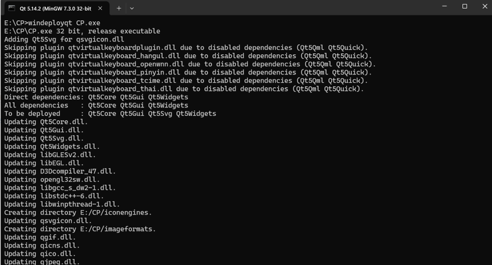

完成打包后，所需的库文件将全都拷贝到exe程序的当前文件路径下，此时点击exe文件即可正常运行程序：

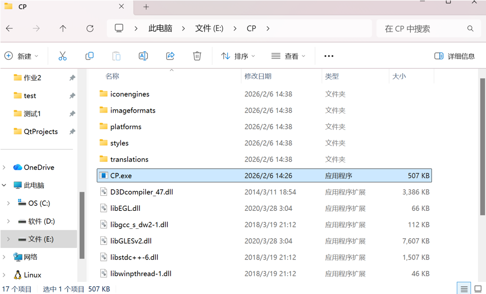

## 任务一系统界面说明与操作指南

通过双击CP.exe可执行程序或用QT Creator打开项目运行后，即可看到任务一系统界面，若看到的是任务二的，则点击系统界面右上角的“转向任务一”切换到任务一的系统界面：

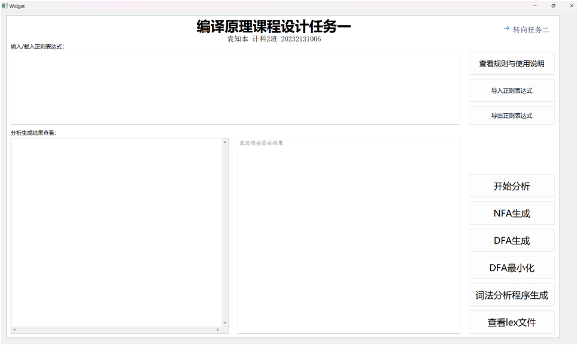

接下来是任务一项目对应的各个功能的使用说明：

首先，点击右侧的“查看规则与使用说明”按钮了解正则表达式的输入要求：

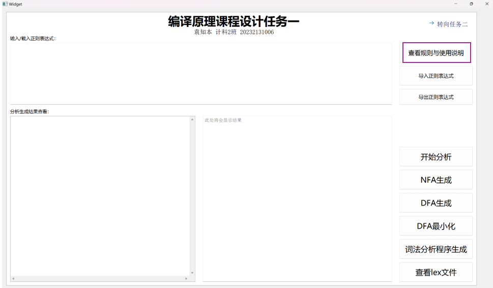

了解完输入规则后，在“输入/载入正则表达式”输入框内载入正则表达式，可以直接键入或者通过右侧的“导入正则表达式”按钮来通过文件选择载入（正则表达式可以通过“导出正则表达式”按钮进行保存），之后点击右侧的“开始分析”按钮，进行正则表达式的预处理工作：

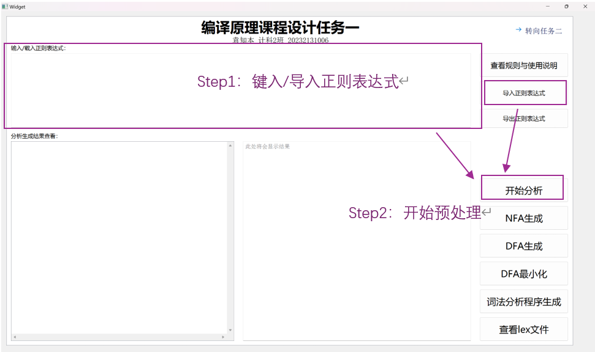

完成预处理后，依次点击右侧按钮“NFA生成”、“DFA生成”、“DFA最小化”，可以依次在“分析生成结果查看”下左侧的表格控件中查看到对应的NFA图（表格形式）、DFA图（表格形式）、最小化DFA（表格形式）：

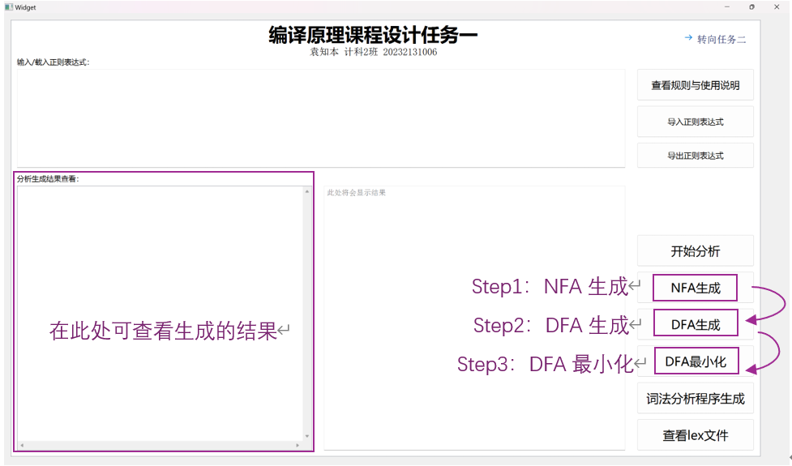

完成上述操作后，点击右侧按钮“词法分析程序生成”，之后选择保存路径，点击“选择文件夹”后，即可完成词法分析程序的生成、保存到指定路径并显示在“分析结果查看”下右侧的文本控件中查看：

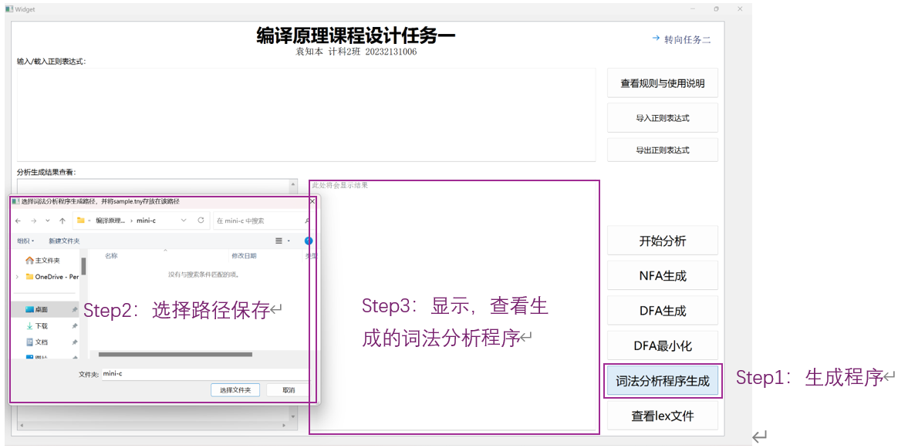

之后，打开控制符命令行窗口，进入到刚才词法分析程序保存的路径下，通过指令`gcc -std=c99 \_lexer.c -o lexer`实现词法分析程序的编译，生成对应的lexer.exe可执行程序：

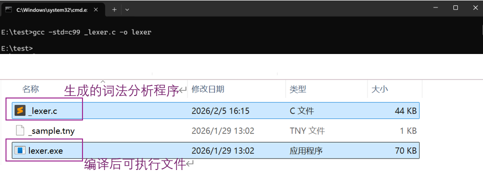

注意，在运行`lexer.exe`文件之前，请务必把测试用的当前正则表达式对应的程序代码文件`_sample.tny`放到词法分析程序`_lexer.c`同一目录路径下，`_sample.tny`内容的编写示例如下：

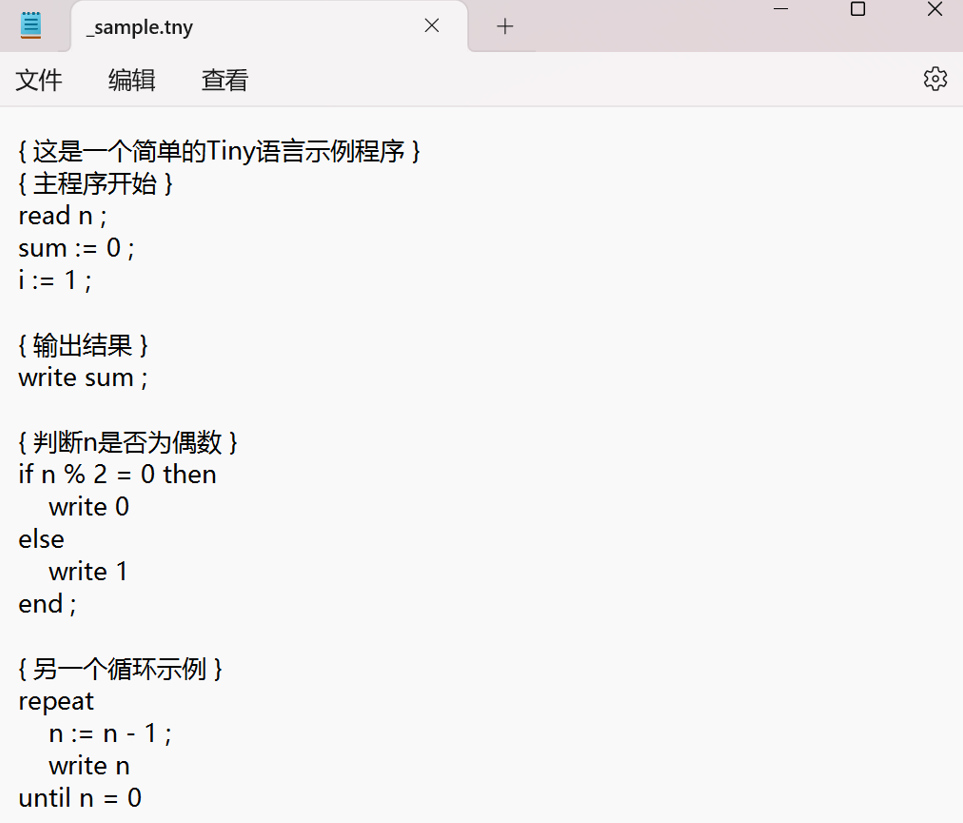

之后，返回命令行窗口，输入指令【lexer】，即可运行词法分析程序对_sample.tny文件中的测试代码进行词法分析，并生成output.lex文件：

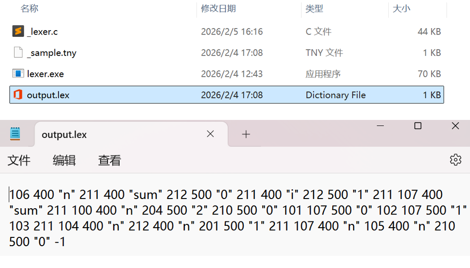

返回任务一系统界面，点击右侧的“查看lex文件”按钮，搜寻刚才生成的output.lex文件，即可在“分析结果查看”下右侧的文本控件中查看：

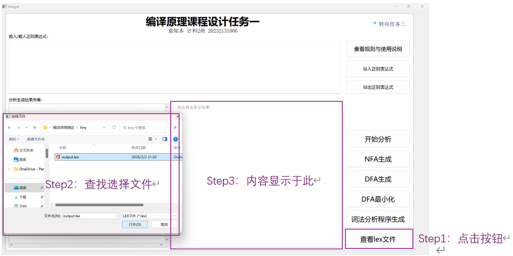

以上即为任务一系统界面说明与操作的全部指南

## 任务二系统界面说明与操作指南

点击任务一系统界面右上角的“转向任务二”按钮：

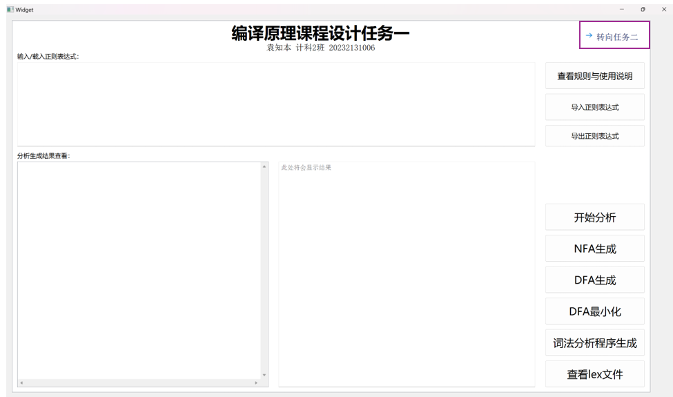

切换到任务二对应的系统界面：

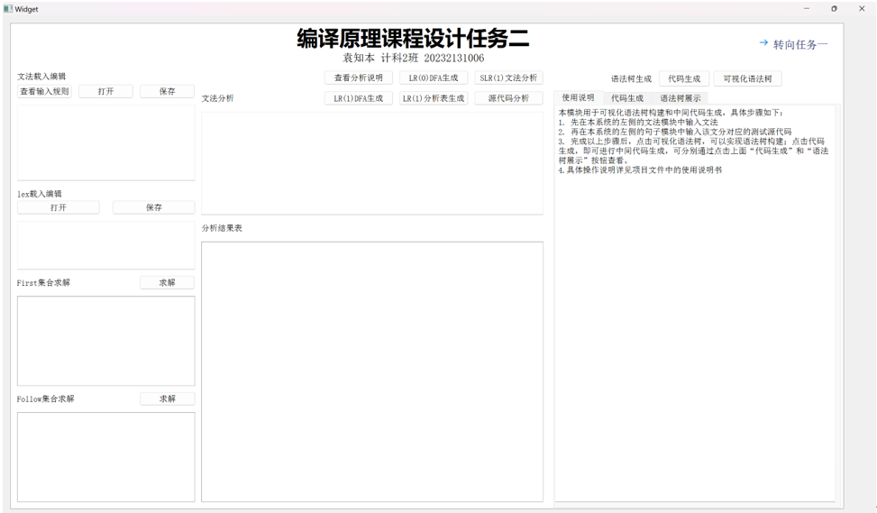

接下来是任务二项目对应的各个功能的使用说明：

首先，点击左侧的“查输入规则”按钮了解文法文本的输入要求，点击中间的“查看分析说明”按钮查看分析结果展示说明，查看右侧的语法树、中间代码生成模块的使用说明：

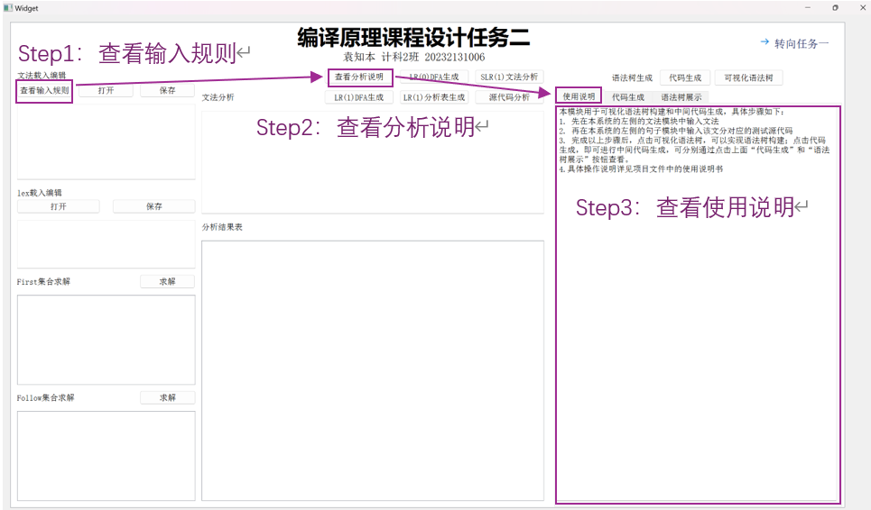

了解完输入规则后，在“文法载入编辑”输入框内载入文法文本，可以直接键入或者通过上侧的“打开”按钮来通过文件选择载入（文法文本可以通过上方的“保存”按钮进行保存）。

之后顺序点击“First集合求解右侧”的“求解”按钮、“Follow集合求解右侧”的“求解”按钮，即可分别查看First集合以及Follow集合：

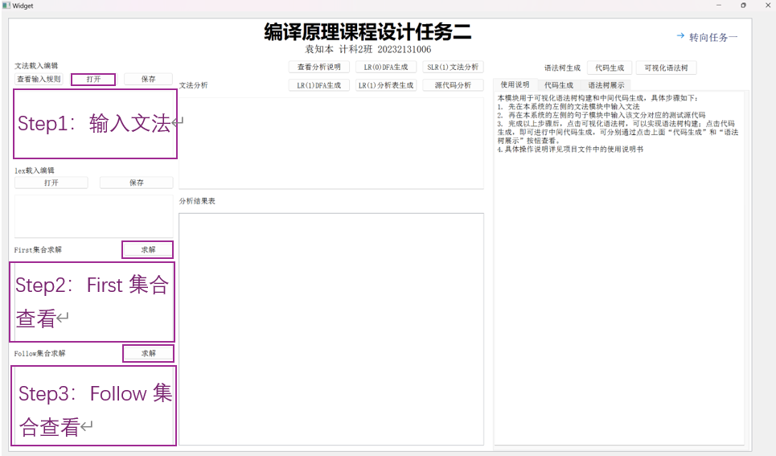

接着，依次顺序点击正上方的“LR(0)DFA生成”按钮、“SLR(1)文法分析”按钮、“LR(1)DFA生成”按钮、“LR(1)分析表生成”按钮，即可依次在“文法分析”下的文本显示控件和“分析结果表”下的表格控件中查看到文法对照、LR(0)DFA（表格形式）、SLR(1)文法分析结果、LR(1)DFA（表格形式）、LR(1)分析表：

此处查看：

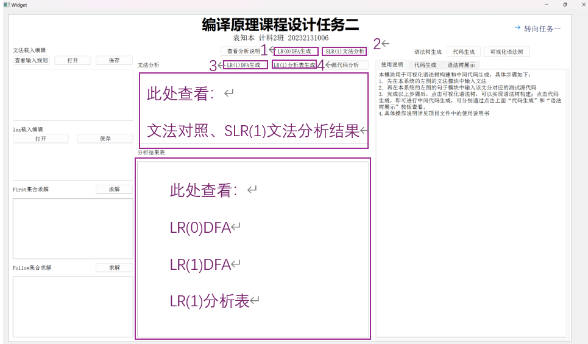

接下来，在“lex载入编辑”下的输入框内载入lex文件文本，可以直接键入或者通过上侧的“打开”按钮来通过文件选择载入（lex文件文本可以通过上方的“保存”按钮进行保存）。

注意，这里的lex文件即刚才任务一得到的output.lex文件。

之后，点击“源代码分析”按钮，即可在“分析结果表”下的表格控件查看到lex文本对应的源程序的代码分析过程：

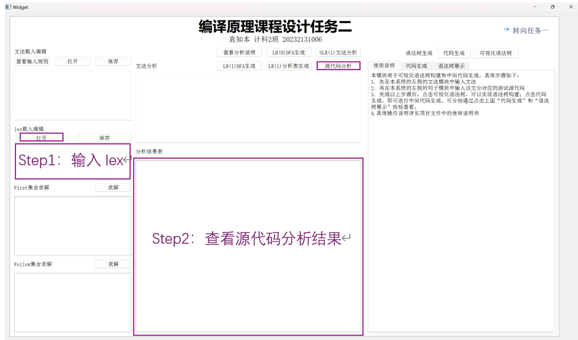

完成源代码分析后，点击“可视化语法树”按钮，再点击下方的“语法树展示”即可查看到生成的语法树：

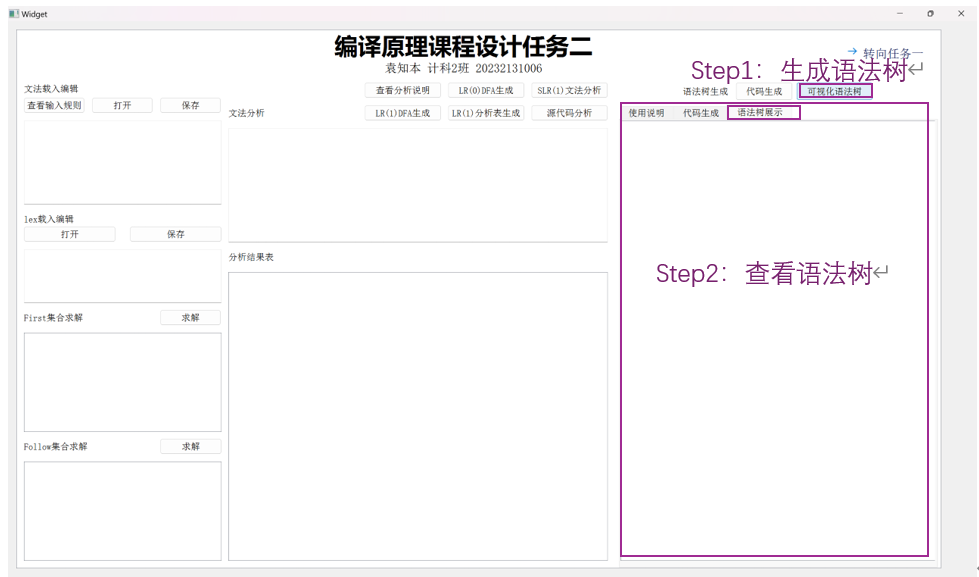

最后，点击“代码生成”按钮，再点击下方的“代码生成”即可查看到生成的中间代码：

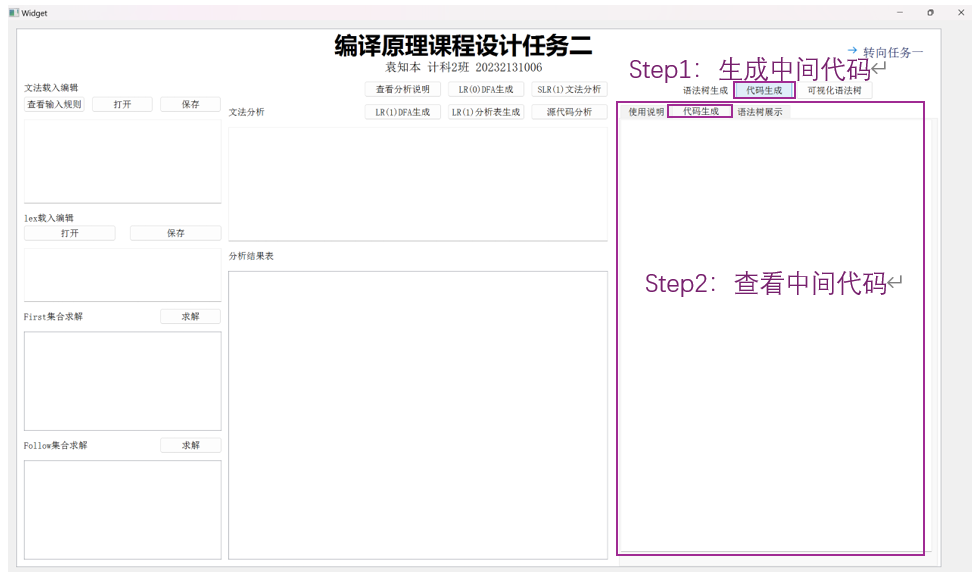

以上即为任务二系统界面说明与操作的全部指南